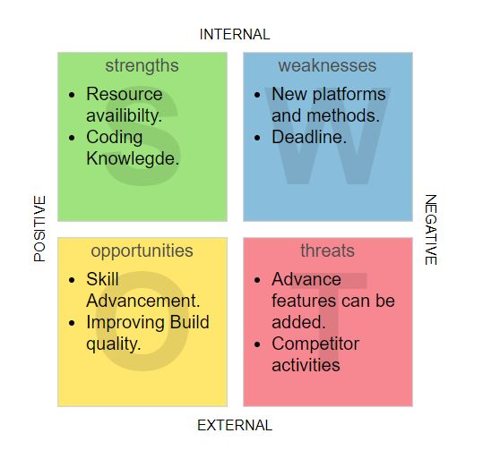

# Requirements
## Introduction
  1.Ride-sharing, or shared mobility, is an “innovative transportation strategy that enables users to gain short-term access to transportation modes on an as-needed basis.” It can include various forms of transportation, such as car-sharing, bike-sharing, carpooling and platform-based ride services (e.g., Uber, Lyft, BlaBlaCar).
  
  2.he objective of this project is to create a code as a prototype for an  application for ride sharing which would bring travel cost of both passesnger and the owner less.
  
  3.The topic was chosen because it will help me to implement various coding practices learnt.

## Benifits
* Some benifits of Ride Sharing system are listed.
   * Minimises travel cost.
   * Easy booking proccess.
   * Saves time.

## Defining Our System
  1.Choice of beign driver or passenger.
  2.Driver and Passengers details collection.
  3.Saving records.
  4.Checking availability.
  5.Fare calculation.
## Assumptions
  * The last driver details is only store(text file),could be further modified as a database to store multiple records
  * Route is considered to have 26 stops from a to z.
  * system takes driver name,starting point,ending point and then readiness to shere.If passenger's route lies within the driver's
    route,the ride is alloted.
  * Estimated fare is calculated based of passenger's start and end point.
  
## SWOT ANALYSIS

# 4W&#39;s and 1&#39;H

## Who:
   For vehicle owners and passengers.

## What:
People use independent vehicles to travel along a same route and on daily basis icreasing traffic,polution and ride cost.A Ride sharing system application could solve this.

## When:
The concept of Ride sharing started first in US during Wold War 2 and then the practices declined in the 1970s.Now in 2020 there are different companies working on this concept (BlaBla) and the practice of ride sharing has been increased in recent times.

## Where:
 This system is internationaly available.
 
## How:
Without a Ride sharing application concept only people in contacts if needed shared their vehicles.The cost of commute for a single person in a vehicle reduces by the implemengation of this concept.Travel with comfort for low price with easy booking is one of major benifits of Ride Sharing application system.

# Detail requirements
## High Level Requirements:
--- TBD in Tabular Format 
-- ID | Description | Status (Implemented/Future)....

##  Low level Requirements:
--- TBD in Tabular Format 
-- ID | Description | Status (Implemented/Future)
